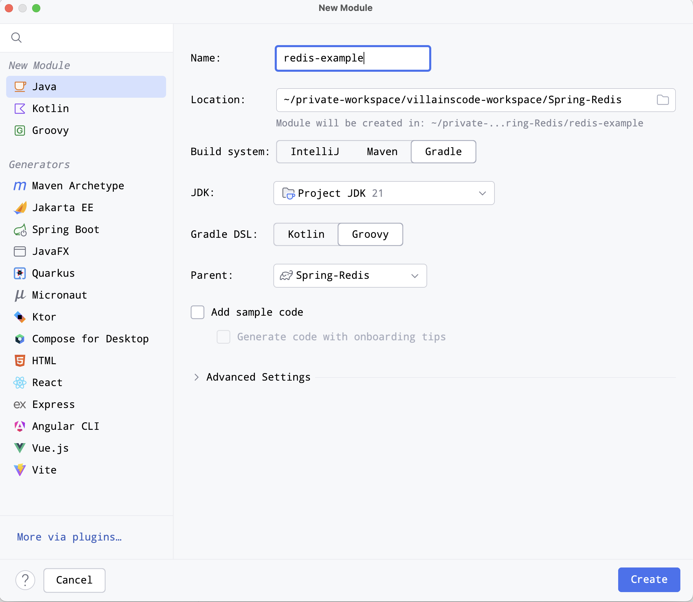
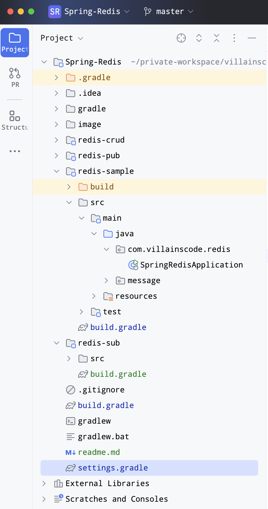

# Spring Redis 샘플 소스

---
> 본 내용은 한빛미디어에서 출간한 책(개발자 기술 면접 노트)의 일부 내용을 보강하기 위해서 만든 Redis 활용 예제입니다.<br>
> 책의 분량상 코드나 이론등의 내용을 다 담아내지 못하였기에 본 문서로 추가적인 설명을 진행합니다.<br>
> 만약 내용에 문제가 있거나 오/탈자가 있을 경우 villainscode@gmail.com으로 메일 부탁드립니다.
>
>
> - Instagram - [https://www.instagram.com/codevillains](https://www.instagram.com/codevillains)
> - email - [villainscode@gmail.com](mailto:villainscode@gmail.com)
> - Yes24 - https://www.yes24.com/Product/Goods/125554439
> - KyoboBooks - https://product.kyobobook.co.kr/detail/S000212738756

## 책 소개

---

### [연봉의 앞자리를 바꾸는] 개발자 기술면접 노트
- 2024.03.25, 한빛미디어, 이남희(codevillain) 저


> **신입 및 주니어 개발직군의 취업 및 이직을 위한 가이드**
>
> 서류 작성 방법부터 , 유망한 회사를 찾는 방법, 코딩 테스트와 기술 면접을 준비하기 위해 알아야 할 개념들을 어떤 방식으로 접근해야 하는지 설명했습니다.
>
> 특히 면접에서 면접관이 던지는 질문의 의도와 해당 질문에 올바르게 답변하기 위한 실질적인 대처방법에 대해서 기술하였습니다.
> 아울러 기술면접을 넘어 인성면접에서 가져야할 마음가짐과 리더십 원칙, 정답이 없는 질문에 대처하기 위한 사례들을 소개하였습니다.
>
> 취업 및 이직의 상황에서 본인이 준비하고 있는 방향이 맞는지 점검하고 커리어 패스를 어떻게 설계해야 하는지 실천 가능한 방법을 제시함으로서 도움을 주고자 하였습니다.

# Redis

---

레디스는 메모리에 데이터를 관리하므로 매우 빠른 속도로 데이터를 조회/저장 할 수 있다. 싱글 스레드 방식으로 동작하며, 데이터 영속성 또한 제공한다. (AOF, RDB) 일반적으로 RDB 방식으로 백업 데이터를 일별로 만들고, 만든 시점 이후부터는 AOF(Append Only File) 형태로 당일 변경사항에 대해서 백업하는 형태로 영속성을 유지할 수 있다.

Event Loop 방식으로 클라이언트가 실행한 명령어들을 이벤트 큐에 적재하고, 싱글 스레드로 하나씩 처리한다.

## 아키텍처

---

일반적인 Replication 세트로 구성해도 무방하지만 센티넬(Sentinel) 이나 클러스터를 구축함으로서, 고가용성 (HA, High Availability)와 Failover를 구성할 수 있다.

센티넬의 경우 센티넬 서버로 클라이언트가 연결하며, 센티넬이 마스터 서버들에게 명령어를 질의한다. 이 과정에서 모니터링이 되어야 하므로 3대 이상의 홀수로 마스터와 레플리카를 구성하는 것이 일반적이며, 장애 발생시 센티넬이 서버들의 동의 절차를 진행하여 (Quorum, 정족수) 마스터 서버를 제외하고 장애 복구 절차를 진행한다.

클러스터의 경우 클러스터에 포함된 노드들이 서로 통신하면서 HA를 유지하며, 샤딩 등의 분산 저장이 가능하다. (Hash 알고리즘)

스프링 애플리케이션 클라이언트는 레디스 클러스터의의 노드 중 하나라도 연결되면 클러스터 전체 정보를 확인할 수 있다.
따라서 운영중 증설을 하더라도 스프링 설정을 변경할 필요가 없다.

## 설치

---

> brew install redis
>

## 실행

---

> brew services start redis or redis-server
brew services stop redis or Ctrl + c
>

## 일반 커맨드

---

### 자료의 저장과 조회

```jsx
> SET Hello world // 저장 
```

```jsx
> GET Hello // 조회 
```

NX 옵션 : 지정한 키가 없을 때에만 새로운 키를 생성 (SET Hello newWorld NX)

XX 옵션 : 키가 있을 때에만 새로운 값으로 덮어씀 (SET Hello newWorld XX)

### String 
자료구조이지만 숫자 형태도 저장 가능하고 INCR이나 INCRBY 를 이용하여 1씩 증가시키거나 입력한 값만큼 증가시킬수 있다.

```jsx
> SET counter 100
> incr counter
(integer) 101
> incrby counter 50
(integer) 151
```

### MSET
MGET으로 여러 키를 조작할 수 있다.

```jsx
> MSET a 10 b 20 c 30
OK
> MGET a b c
1) "10"
2) "20"
3) "30"
```

### LIST 타입의 조작  
List 타입(배열)의 경우 LPUSH(head)를 이용해 List의 왼쪽에 데이터를 삽입하고, RPUSH(tail)을 통해 List의 오른쪽에 데이터를 삽입한다.

```jsx
> LPUSH mylist e
(integer) 1
> RPUSH mylist b
(integer) 2
> LRANGE mylist 0 -1
1) "e"
2) "b"
```

LRANGE를 통해 시작과 끝 인덱스를 조회할 수 있다.

LPOP을 이용하여 기본삭제 (맨 앞)를 하거나 지정된 수 만큼 삭제 할 수 있다.

LTRIM의 경우 지정된 두 범위만 남기고 나머지는 삭제한다.

```jsx
LPOP mylist
"A"
> LRANGE mylist 0 -1
1) "B"
2) "C"
3) "A"
4) "D"
5) "e"
6) "b"
> LPOP mylist 6
1) "B"
2) "C"
3) "A"
4) "D"
5) "e"
6) "b"
> LRANGE mylist 0 -1
(empty array)
> LPUSH mylist D A C B A
(integer) 5
> LTRIM mylist 0 1
OK
> LRANGE mylist 0 -1
1) "A"
2) "B"
```

LINSERT를 통해 원하는 데이터 앞(before) 혹은 뒤(after)에 데이터를 추가할 수 있다.

```jsx
> LINSERT mylist BEFORE B C
(integer) 3
> LRANGE mylist 0 -1
1) "A"
2) "C"
3) "B"
```

LSET을 통해 지정된 인덱스에 신규로 입력하여 덮어쓸 수 있다

```jsx
> LSET mylist 1 D 
> LRANGE mylist 0 -1
1) "A"
2) "D"
3) "B"
```

LINDEX 를 통해 원하는 인덱스의 데이터를 조회할 수 있다.

```jsx
> LINDEX mylist 2
"B"
```

### HASH

Key, Value에서 Value의 구조 역시 필드와 값으로 이루어진 아이템 집합이다.

HSET 커맨드를 이용해서 아이템들을 저장할 수 있으며, HGET을 통해 조회할 수 있다.

HMGET으로 여러 필드를 조회할 수 있고, HGETALL을 통해 hash의 모든 필드를 반환받을 수 있다.

```jsx
> HSET Product1 name "samsung"
(integer) 1
> HSET Product1 device "gal 22"
(integer) 1
> HSET Product1 version "2021"
(integer) 1
> HSET Product2 name "apple" device "iphone 11 pro" version "2022"
```

```jsx
> HGET Product1 name
"samsung"
> HMGET Product2 name device 
1) "apple"
2) "iphone 11 pro"
> HGETALL Product1
1) "name"
2) "samsung"
3) "device"
4) "gal 22"
5) "version"
6) "2021"
```

### SET

정렬되지 않고 중복 저장이 되지 않는 문자열이다.

SADD로 Set에 저장할 수 있으며 SMEMBERS로 Set 자료를 볼 수 있다.

SREM으로 원하는 데이터를 삭제할 수 있고, SPOP으로 내부 아이템을 반환하고 삭제할 수 있다.

합집합은 SUNION, 교집합은 SINTER, 차집합은 SDIFF로 수행할 수 있다.

```jsx
> SADD myset a
(integer) 1
> SADD myset  a a a b b b c c c 
(integer) 2
> SMEMBERS myset
1) "a"
2) "b"
3) "c"
> SREM myset b
(integer) 1
> SMEMBERS myset
1) "a"
2) "c"
> SPOP myset
"a"
> SMEMBERS myset
1) "c"
```

```jsx
> SADD set1 a b c d e 
(integer) 5
> SADD set2 d e f g h 
(integer) 5
> SINTER set1 set2
1) "d"
2) "e"
> SDIFF set1 set2
1) "a"
2) "b"
3) "c"
> SDIFF set2 set1
1) "f"
2) "g"
3) "h"
```

### Sorted Set

스코어값에 따라 정렬되는 문자열. 모든 아이템은 스코어-값 쌍으로 저장되며 저장시 스코어로 정렬 처리된다.

```jsx
> ZADD score:1 100 user:B
(integer) 1
> ZADD score:1 150 user:A 150 user:C 200 user:F 300 user:E
(integer) 4
> ZRANGE score:1 1 3
1) "user:A"
2) "user:C"
3) "user:F"
> ZRANGE score:1 100 150 BYSCORE
1) "user:B"
2) "user:A"
3) "user:C"
```

그밖에 Bitmap이나 Hyperloglog, Geospatial(위경도), Stream(메시지브로커) 등이 있다.

## Key 관련 커맨드

---

### 키 조회

```jsx
 > EXISTS key-name
```

### 전체 키 조회

```jsx
> KEYS [pattern] | * // 패턴 조회 혹은 모든 키 조회 
- KEYS 수행 비용은 높기 때문에 수십만개의 키 정보를 반환하는 것은 helth check 응답이 없어 페일오버가 날 수 있다. (다른 커맨드도 사용불가) 
```

### Pattern 스타일

- h?llo → hello, hallo 매칭
- h*llo → hllo, heeello 매칭
- h[ae]llo → hello, hallo 매칭, hillo는 매칭 불가
- h[^e]llo → hallo, hbllo 매칭, hello는 매칭 불가
- h[a-b]llo → hallo, hbllo 매칭

### 키 변경

```jsx
> RENAME key newKey
> RENAMENX key newKey
```

### 키 삭제

```jsx
> FLUSHALL [sync | async]
or
> DEL key [key-name]
or 
> UNLINK key [key-name]
```

### DEL 
DEL 의 경우 동기적으로 수행하기 때문에 레디스 인스턴스에 영향을 주고, 이 때문에 가급적 DEL 보다는 UNLINK로 처리해야 백그라운드로 키를 삭제하여 성능상 이슈가 없게 된다.

키 만료 지정

```jsx
> EXPIRE key secontd [NX | XX | GT | LT]
> EXPIRETIME key // 키 삭제 시간 반환, 만료시간 없을 경우 -1, 키 없을 경우 -2 반환 
```

TTL의 경우 키의 만료시간을 반환한다.

```jsx
> TTL key // 몇 초 뒤에 만료되는지 반환, 만료시간 없을 경우 -1, 키 없을 경우 -2 반환 
```

## Geospatial Index (위치 데이터)

---

### GEO SET

위치 정보를 경도와 위도 쌍으로 저장하며, 내부적으로 sorted set 구조로 저장한다.

```jsx
> GETADD user 20.123123123 12.2133255345
```

특정 식당을 레스토랑이라는 키에 경도, 위도, 식당 이름순으로 저장할 경우 아래와 같다.

```jsx
> GEOADD restaurant 30.0123123 34.123123354 pangyo // 저장 

> GEOPOS restaurant pangyo // 저장된 데이터 
1) 1) "30.01231223344802856"
   2) "34.12312216686382982"

> GEOSEARCH restaurant FROMLONLAT 30.0123123 34.123123354 byradius 1km // FROMLONLAT 으로 경도, 위도 지정 후 byradius 로 반경 1km 조회
> GEOSEARCH key FROMMEMBER member bybox 4 2 km // 동일한 위경도 값 기준으로 witth 와 height에 대항하는 데이터 검색 (직사각형)
```

그밖에 레디스를 캐시로 사용하거나 세션 스토어로 사용하거나 메시지 브로커 등으로 활용할 수 있다.

# 프로젝트 설정 

---

1. github.com에서 본인 계정의 빈 github project repository 생성  
2. 로컬 clone 후 Springboot gradle 프로젝트 생성 (Spring-Redis) 
3. root(Spring-Redis)에서 new > module...선택 
4. Java project 선택 후 프로젝트 네임 입력, Gradle, Groovy 선택 후 Create 클릭
5. root의 src 폴더는 필요 없으므로 삭제
6. 이와 같은 형태로 여러 프로젝트 하위에 멀티 모듈 형태로 생성할 수 있으며, 연관관계를 따로 맺지 않고 개별 프로젝트로 사용함 



## 프로젝트 구조 

---



> redis-sample : Spring startup시 간단한 메시지 출력 예제 
> 
> redis-crud : redis를 이용한 CRUD 활용 예제
> 
> redis-pub/sub : message publish/subscribe 예제 
> 

root의 build.gradle은 아래와 같다. 하위 프로젝트들은 root의 설정에 의존성을 갖는다.
```groovy
plugins {
    id 'java'
    id 'org.springframework.boot' version '3.3.1'
    id 'io.spring.dependency-management' version '1.1.5'
}

group = 'com.villainscode'
version = '0.0.1-SNAPSHOT'

java {
    sourceCompatibility = '17'
}

configurations {
    compileOnly {
        extendsFrom annotationProcessor
    }
}

// 하위 프로젝트 모듈의 공통 플러그인 및 의존성 정의
subprojects {
    apply plugin: 'java-library'
    apply plugin: 'idea'
    apply plugin: 'org.springframework.boot'
    apply plugin: 'io.spring.dependency-management'
    apply plugin: 'java'
    compileJava.options.encoding = 'UTF-8'
    sourceCompatibility = '17'

    task wrapper(type: Wrapper) {
        gradleVersion = '8.1.1'
    }

    repositories {
        mavenCentral()
    }

    dependencies {
        compileOnly 'org.projectlombok:lombok'
        developmentOnly 'org.springframework.boot:spring-boot-devtools'
        annotationProcessor 'org.springframework.boot:spring-boot-configuration-processor'
        annotationProcessor 'org.projectlombok:lombok'
        testImplementation 'org.springframework.boot:spring-boot-starter-test'
        implementation 'org.springframework.boot:spring-boot-starter-data-redis'
    }


    tasks.named('test') {
        useJUnitPlatform()
    }
}

```
root의 settings.gradle을 아래와 같다. 하위 프로젝트 생성 후 gradle refresh 하면 자동으로 추가된다.
```groovy
rootProject.name = 'Spring-Redis'
include 'redis-sample'
include 'redis-crud'
include 'redis-pub'
include 'redis-sub'
```
각 하위 프로젝트는 해당 프로젝트에서 필요한 모듈의 dependencies들을 각 build.gradle 에 추가해준 후 사용하면 된다.


